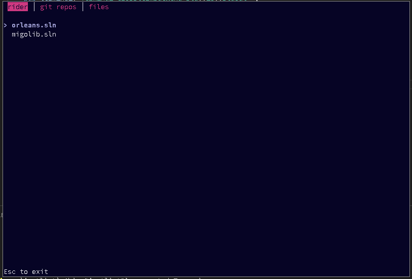

# justlist

This is a simple organizer app, that helps you launch an app with search-as-you-type workflow. Inspired by the Rofi, but with cross-platform terminal interface in mind. It's implemented as the visualizer app with a set of plugins. Each plugin generates its own list, for example, it lists git repositories in a target folder or lists project files or even downloads a list from a network.

These plugins are executed as a chain with bash's pipe operator, like this: plugin1 | plugin2 | plugin3 | justlist The last command must be "justlist" to visualize combined lists content as a set of tabs.

